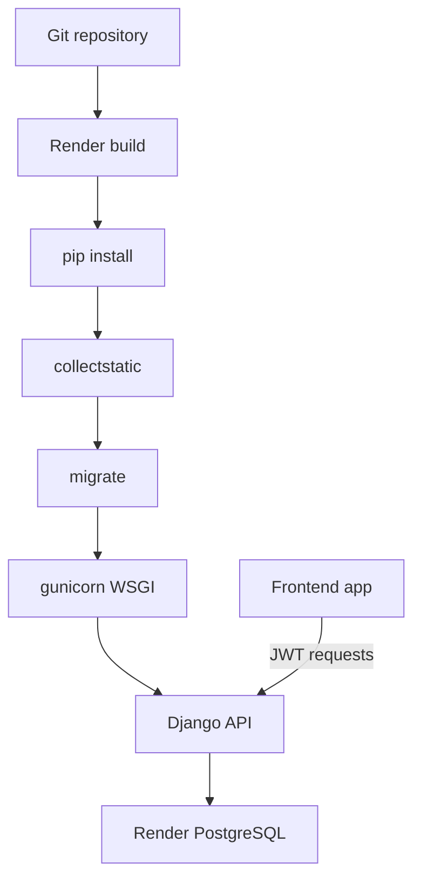

# Deploying to Render

This guide covers deploying the E-commerce Catalog API as a Render **Web Service** with a managed **PostgreSQL** database.

**Swagger UI (after deploy):** `https://<your-service>.onrender.com/api/docs/`  
**OpenAPI schema:** `https://<your-service>.onrender.com/api/schema/`

---

## Architecture



---

## 1. Create Render resources

### Option A: Blueprint (`render.yaml`)

If this repo includes `render.yaml` at the root, use **New → Blueprint** in Render and connect the repository. Set secret env vars in the dashboard after the blueprint is applied.

### Option B: Manual setup

1. **New → PostgreSQL** — note the **Internal Database URL** (or External if needed).
2. **New → Web Service** — connect this repository.
   - **Runtime:** Python 3
   - **Region:** same as the database when possible

---

## 2. Render commands

| Phase | Command |
| :--- | :--- |
| **Build** | `pip install -r requirements.txt && python manage.py collectstatic --noinput` |
| **Pre-deploy** | `python manage.py migrate` |
| **Start** | `gunicorn E_commerce_catalog_api.wsgi:application` |

Render sets `PORT` automatically; Gunicorn binds to `$PORT` when you use:

```bash
gunicorn E_commerce_catalog_api.wsgi:application --bind 0.0.0.0:$PORT
```

If your Render start command field does not expand `$PORT`, use the default Gunicorn command above — Render injects `PORT` into the environment and Gunicorn 22+ reads it when `--bind` is omitted in some setups; **prefer explicitly binding to `$PORT`** in the Render dashboard start command.

---

## 3. Environment variables

Set these on the **Web Service** (not in git):

| Variable | Required | Example / notes |
| :--- | :--- | :--- |
| `DATABASE_URL` | Yes (Render) | From Render Postgres dashboard |
| `SECRET_KEY` | Yes | Long random string |
| `DEBUG` | Yes | `False` |
| `ALLOWED_HOSTS` | Yes | `your-api.onrender.com` |
| `CORS_ALLOWED_ORIGINS` | Yes | `https://your-frontend.onrender.com` |
| `CSRF_TRUSTED_ORIGINS` | Recommended | `https://your-api.onrender.com,https://your-frontend.onrender.com` |
| `EMAIL_HOST` | Yes (OTP) | SMTP provider host |
| `EMAIL_PORT` | Yes | `587` |
| `EMAIL_HOST_USER` | Yes | SMTP username |
| `EMAIL_HOST_PASSWORD` | Yes | SMTP password |
| `EMAIL_USE_TLS` | Yes | `True` |
| `DEFAULT_FROM_EMAIL` | Yes | Sender address |

Optional (defaults apply when `DEBUG=False`):

| Variable | Default |
| :--- | :--- |
| `SECURE_SSL_REDIRECT` | `True` |
| `SESSION_COOKIE_SECURE` | `True` |
| `CSRF_COOKIE_SECURE` | `True` |

Local development can keep using `POSTGRES_*` in `.env` when `DATABASE_URL` is unset.

---

## 4. First-deploy checklist

1. Push code with migrations applied in the repo.
2. Create Postgres + Web Service on Render.
3. Set all env vars above.
4. Deploy and wait for build + pre-deploy migrate to succeed.
5. Open **Logs** — confirm Gunicorn started without errors.
6. Smoke test:
   - `GET /api/products/` — public catalog
   - `GET /api/docs/` — Swagger UI
   - Register → verify OTP → login → `GET /api/auth/me/` with JWT
7. (Optional) Seed catalog on Render shell or one-off job:

   ```bash
   python manage.py populate_shoes
   ```

8. Create a staff user for promotion CRUD:

   ```bash
   python manage.py createsuperuser
   ```

---

## 5. Frontend integration

Point the React/Vite app at the Render API base URL, e.g.:

```text
https://your-api.onrender.com
```

Ensure the frontend origin is listed in `CORS_ALLOWED_ORIGINS`. JWT flows are unchanged; see `Documentation/router.md` for endpoint details.

---

## 6. Troubleshooting

| Symptom | Likely cause |
| :--- | :--- |
| `DisallowedHost` | Add Render hostname to `ALLOWED_HOSTS` |
| CORS errors in browser | Add frontend URL to `CORS_ALLOWED_ORIGINS` |
| `column ... does not exist` | Run migrations: pre-deploy `python manage.py migrate` |
| Admin has no CSS | Build must run `collectstatic`; WhiteNoise is enabled in settings |
| OTP emails not sent | Check SMTP env vars and provider allowlist |
| 502 on cold start | Render free tier spins down; first request may be slow |

---

## 7. Out of scope on Render (current backend)

- Real payment provider (checkout uses stub `confirm-payment`).
- Uploaded product media (products use external `image_url`).
- Background workers / Celery (OTP email is synchronous SMTP).

For integration details beyond deployment, see the other guides in `Documentation/`.
